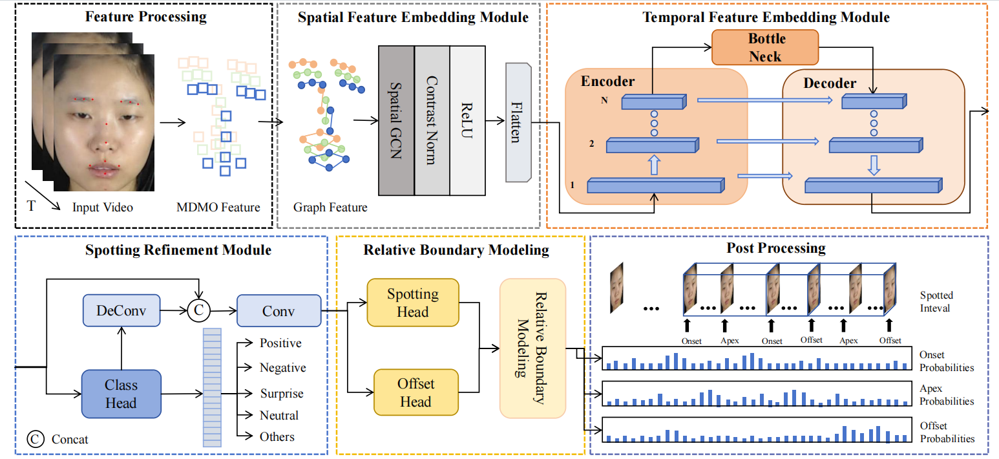
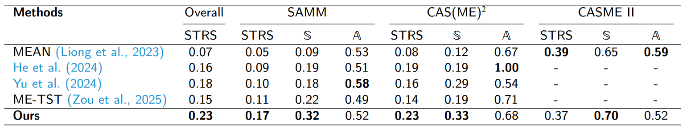

# R2S: Recognize-then-Refine-Spot network





## Results
We compare our method against others on three benchmark datasets, i.e., [CAS(ME)<sup>2</sup>](http://fu.psych.ac.cn/CASME/cas(me)2-en.php), [CASME II](http://casme.psych.ac.cn/casme/c2), and [SAMM-LV](http://www2.docm.mmu.ac.uk/STAFF/M.Yap/dataset.php) in terms of STRS、F1-Score Spotting、F1-Score Analysis:



## Experiment environment 
OS: Ubuntu 20.04.4 LTS 

Python: 3.9.0

Pytorch: 1.13.1

CUDA: 11.6, cudnn: 8.5.0

GPU: NVIDIA GeForce RTX 3090 

## Getting started
1. Clone this repository
```shell
$ git clone git@github.com:YanSun-github/R2S-Net.git
$ cd RRSN-MEA
```

2. Prepare environment

```shell
$ conda create -n env_name python=3.8
$ conda activate env_name
$ pip install -r requirements.txt
```

3. Download features

 

4. Training and Inference

Set `SUB_LIST`, 
`OUTPUT` (dir for saving ckpts, log and results)
and `DATASET` ( ["samm" | "$cas(me)^2$"] )  in [pipeline.sh], then run:
```shell
$ bash pipeline.sh
```

**We also provide ckpts, logs, etc.** to reproduce the results in the paper, please download [ckpt.tar.gz](https://pan.baidu.com/s/126HNyPz9kHOZb4oR70u4Ww?pwd=4321).

 

 
## Citation
If you feel this project helpful to your research, please cite our work.
 
```
@article{SUN2026104478,
title = {R2S-Net: Recognize-then-refine-spot network for micro-expression spot-then-recognize},
journal = {Information Processing & Management},
volume = {63},
number = {2, Part B},
pages = {104478},
year = {2026},
issn = {0306-4573},
doi = {https://doi.org/10.1016/j.ipm.2025.104478},
url = {https://www.sciencedirect.com/science/article/pii/S0306457325004194},
author = {Yan Sun and Zhiliang Wang and Xiangfeng Luo},
}
``` 

##### You may open an issue or email me at yansun@shu.edu.cn if you have any inquiries or issues.
